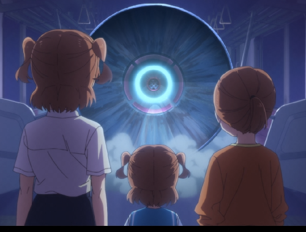

# 《过去与未来》原作与本体特效选型

2026-09-28。仅研究，不改运行时代码。前两版圆弧／双舞台框均不作为已认可设计。

## 最直接的画面依据：现有卡图

可直接观察：人物望向蓝白色圆形光源，光源外围有深色圆形结构，中心明亮，向周围放射光束，背景是剧场结构。画面没有“蓝门和金门”，也没有卡牌飞越双门的动作。不能仅凭牌名把“过去／未来”自行转译为两扇门。

此图片来自项目现有素材。当前尚未在官方公开视频中逐帧匹配到该帧，不能把具体集数、时间码、人物身份或装置名称写成已证实事实。它看起来属于幼年华恋相关画面，但这只是待核实线索。

## 官方材料与证据范围

- [武士道 2021 年 6 月官方宣发 PDF](https://bushiroad.com/media/296f8b7cf70191f3)，第 2 页列出官方频道的 90 秒预告和本篇开头公开片段。已核实链接出处；本轮未成功读取视频画面，不声称已观看或已定位卡图。
- [官方预告](https://www.youtube.com/watch?v=z5hfWlnhTqk)。用于进一步确认现成舞台演出，不把预告的存在当作某种视觉设计已得到原作支持。
- [官方本篇开头公开片段](https://www.youtube.com/watch?v=3cRbp_8Gj1w)。同上，待逐帧核对。
- [Febri 古川知宏导演访谈③](https://febri.jp/topics/starlight_director_interwiew_3/)。导演谈到通过幼年经历描写华恋，以及死与再生主题；该访谈支持叙事背景，**不证明双门、蓝金分色或卡牌残影是原作演出**。

## 可复用的游戏本体现成特效

以下来自本地游戏反编译代码与场景文件，已读调用和资源结构；本轮尚未录制这些候选在当前双版本的独立对比，不把代码检查写成视觉验收。

| 候选 | 已有依据 | 对本牌的适用方式 | 结论 |
| --- | --- | --- | --- |
| 普通强化 `NPowerUpVfx.CreateNormal` | 本体 `Inflame.OnPlay`、`Corruption.OnPlay` 等直接调用；节点播放约 1 秒，前后分层 | 作为约定抽牌获得力量时的短强化反馈；复用原场景，不另外画门框／符号 | **优先做实机候选对比**。机制一致，辨识度来自成熟的原版表现；不声称它是动画里的效果 |
| 通用增益粒子 `NPowerAppliedBuffVfx` | 现成 `vfx/ui/vfx_buff_applied.tscn`，播放粒子后约 2 秒清理 | 做克制的抽牌增益反馈，沿用现有力量文字／图标 | 备选；需要检查现有流程是否已经播放，避免叠加两遍 |
| 幽灵强化 `NPowerUpVfx.CreateGhostly` | 现成 Ghostly 场景和公开工厂接口；本轮搜索未发现卡牌直接调用 | 仅作为视觉候选比较，不能因为“过去”就把幽灵解读成记忆 | 不优先，先看实录再判断 |
| 星形命中 `NStarryImpactVfx` | 现成粒子，代码还附带弱震屏 | 属于命中反馈，不宜为频繁获得力量反复震屏 | 排除为本牌主效果 |

### 定位路径

根目录：`D:/Github/spire-codex/extraction/raw/`

- `src/Core/Models/Cards/Inflame.cs`（普通强化的真实卡牌调用）
- `src/Core/Nodes/Vfx/NPowerUpVfx.cs`
- `scenes/vfx/vfx_power_up/vfx_power_up.tscn`
- `scenes/vfx/vfx_ghostly_power_up/vfx_ghostly_power_up.tscn`
- `src/Core/Nodes/Vfx/Ui/NPowerAppliedBuffVfx.cs`
- `scenes/vfx/ui/vfx_buff_applied.tscn`
- `src/Core/Nodes/Vfx/NStarryImpactVfx.cs`

`NPowerUpVfx` 会将 BackVfx 重新挂到战斗后景容器，因此不能只缩放根节点便宣称小人物兼容；前后层的定位、尺寸、清理都需在实际接入时核对。

## 建议与下一步边界

先展示两种**原样复用**的原版效果：普通强化与通用增益粒子，比较在 Karen 约定抽牌时的实际表现。先不为本牌强加常驻装饰；已有约定塔继续承担常驻牌堆提示。若需要动画专属外观，则以卡图中的圆形光源为核对目标，找到可确认的原片运动方式后再复现；当前不凭单帧编出新的动态。

本轮没有修改代码、覆盖部署或制作新的设计特效。上一版双框代码仍留在实验分支，尚未合并；后续选定方案时替换，不视为已接受成品。其他稀有卡沿用“原作画面／现成资源 → 明确出处 → 少量适配 → 实机录像 → 用户确认”的流程。
